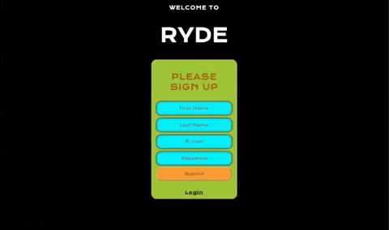
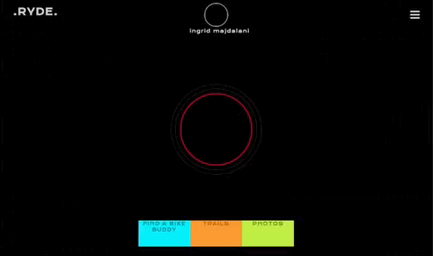
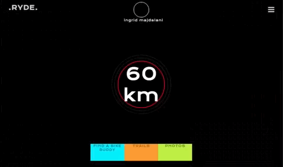
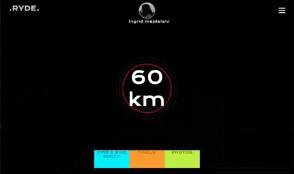
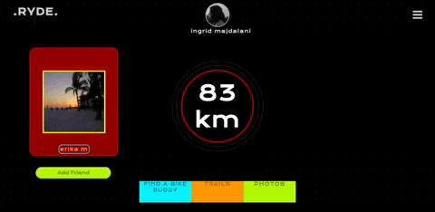
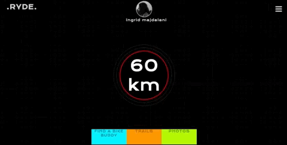
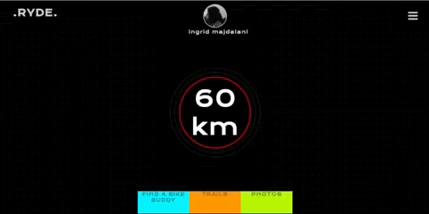
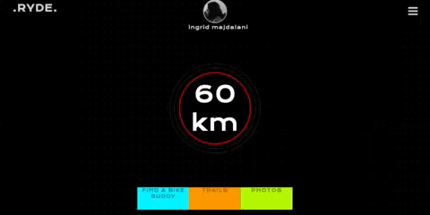

# RYDE

## Summary:
A social network project. The main goal of RYDE is to connect cyclists on a website. If ever a cyclist feels like going for a ride, they could easily connect on this website prototype and find other cyclists in the same city to go on a ride with.
## Tech Stack:
* React.js and Redux
* Express.js on Node.js
* PostgreSQL Database
* socket.io

## Features:

* The website includes user registration and user sign-in.

* Users can update their distance travelled by bike thus far.

* Users can also upload multiple profile pictures and view all the images uploaded thus far.

* Users can find other users and see their distance travelled by bike. Users can also add other users as friends.

* Users can see in real-time other users that are online.

* Users also have access to a public chat.

* Users can see a list of pending friend requests and list of friends.

